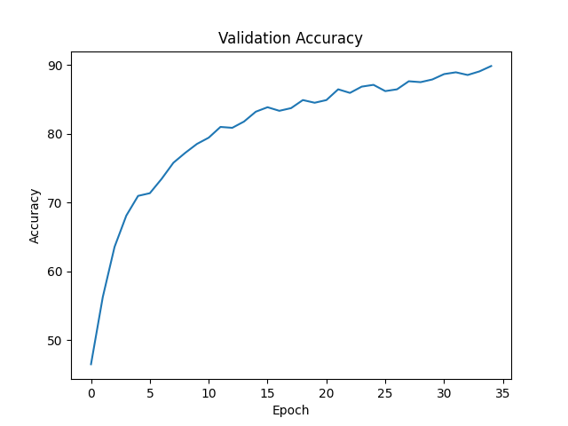
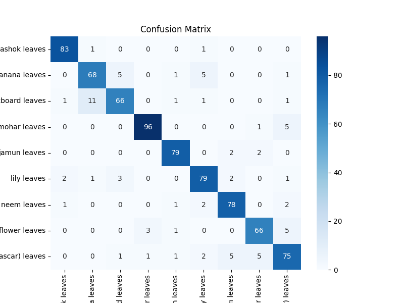

# 🌿 Leaf Classification using Self-Supervised Learning (SimCLR)

A deep learning-based leaf classification system that combines
**Self-Supervised Learning (SimCLR)** with supervised fine-tuning to
classify leaf images across **9 plant species**.

The project includes SimCLR-based representation learning, a custom CNN
encoder, supervised classification, model evaluation, and an interactive
**Streamlit web application** for real-time predictions.

## 🚀 Live Demo

**[Launch the Leaf
Classifier](https://leaf-classification-nn-xteamlrhv3f5ch6rylayzb.streamlit.app/)**

## 📌 Overview

Traditional image classification generally requires a large amount of
labeled training data. This project explores **Self-Supervised Learning
using SimCLR** to learn meaningful visual representations before
performing supervised classification.

### Workflow

``` text
Leaf Images
     ↓
Data Augmentation
     ↓
SimCLR Self-Supervised Pretraining
     ↓
CNN Feature Representation
     ↓
Supervised Fine-Tuning
     ↓
9-Class Leaf Classification
     ↓
Streamlit Deployment
```

## ✨ Key Features

-   🔬 Self-Supervised Learning using **SimCLR**
-   🧠 Custom CNN Encoder
-   🔄 Contrastive Representation Learning
-   🎯 Supervised Fine-Tuning
-   🖼️ Image Augmentation and Preprocessing
-   📊 Accuracy Analysis
-   📉 Confusion Matrix Evaluation
-   🌿 9-Class Leaf Classification
-   🌐 Interactive Streamlit Web Application
-   📈 Prediction Confidence and Class Probabilities
-   ☁️ Streamlit Community Cloud Deployment
-   📦 Git LFS for Large Model Storage

## 📂 Project Structure

``` text
Leaf-Classification-NN/
│
├── Images/
│   ├── accuracy_plot.png
│   └── confusion_matrix.png
│
├── dataset/
│   └── README.md
│
├── models/
│   └── README.md
│
├── src/
│   ├── app.py
│   ├── nn_pretrain.py
│   ├── predict.py
│   └── rest.py
│
├── leaf_classifier.pth
├── requirements.txt
├── .gitignore
├── .gitattributes
└── README.md
```

### Source Files

  File                    Description
  ----------------------- ----------------------------------------
  `src/app.py`            Streamlit web application
  `src/nn_pretrain.py`    SimCLR self-supervised pretraining
  `src/rest.py`           Classification training and evaluation
  `src/predict.py`        Model prediction script
  `leaf_classifier.pth`   Trained classification model
  `Images/`               Model evaluation visualizations

# 🧠 Methodology

## 1. Self-Supervised Pretraining --- SimCLR

The first stage uses **SimCLR (Simple Framework for Contrastive Learning
of Visual Representations)** to learn meaningful image representations
without relying on class labels.

### Process

-   Generate multiple augmented views of the same image.
-   Pass augmented images through a CNN encoder.
-   Generate feature representations.
-   Use a projection head for contrastive learning.
-   Maximize similarity between representations of the same image.
-   Minimize similarity between representations of different images.

``` text
Original Image
      ↓
Data Augmentation
   ↙        ↘
View 1     View 2
   ↓          ↓
CNN Encoder
   ↓          ↓
Projection Head
   ↘        ↙
Contrastive Loss
```

The resulting encoder learns useful visual features that can be
transferred to the supervised classification stage.

## 2. Supervised Fine-Tuning

The pretrained encoder is used as the feature extractor for the
classification task.

The classification architecture consists of:

``` text
Input Image
     ↓
CNN Encoder
     ↓
256-D Feature Representation
     ↓
Linear Layer (256 → 128)
     ↓
ReLU
     ↓
Dropout
     ↓
Linear Layer (128 → 9)
     ↓
Class Prediction
```

The model is fine-tuned using labeled leaf images to classify the nine
target species.

## 3. Prediction System

The prediction pipeline performs the following steps:

1.  Load the trained PyTorch model.
2.  Upload a leaf image.
3.  Resize the image to `224 × 224`.
4.  Convert the image into the required tensor format.
5.  Perform model inference.
6.  Calculate class probabilities using Softmax.
7.  Return the predicted leaf species and confidence score.

# 🌿 Supported Classes

The model classifies images into the following **9 leaf species**:

  \#   Leaf Species
  ---- -------------------------------
  1    Ashok Leaves
  2    Banana Leaves
  3    Blackboard Leaves
  4    Gulmohar Leaves
  5    Jamun Leaves
  6    Lily Leaves
  7    Neem Leaves
  8    Paper Flower Leaves
  9    Sadabahar (Madagascar) Leaves

# 📊 Model Performance

## Validation Accuracy

<p align="center">
  
</p>

- **Final Validation Accuracy:** ~90%
- Training performed for approximately **35 epochs**
- Stable convergence observed after approximately **20 epochs**
- Strong classification performance across the nine leaf classes

## Confusion Matrix

<p align="center">
  
</p>

The confusion matrix shows a strong diagonal pattern, indicating that the model correctly classifies most validation samples.

Minor misclassification is observed between visually similar leaf species.

# 🌐 Streamlit Web Application

The project includes an interactive Streamlit application for real-time
leaf classification.

### Application Features

-   Upload `.jpg`, `.jpeg`, or `.png` leaf images
-   Display the uploaded image
-   Predict the leaf species
-   Display prediction confidence
-   Visualize class-wise probability distribution
-   Responsive wide-layout interface
-   Real-time model inference

### Prediction Workflow

``` text
Upload Leaf Image
        ↓
Image Preprocessing
        ↓
Trained CNN Model
        ↓
Prediction
        ↓
Confidence Score
        ↓
Class Probability Distribution
```

# ⚙️ Installation and Setup

## 1. Clone the Repository

``` bash
git clone https://github.com/Akash7644/Leaf-Classification-NN.git
cd Leaf-Classification-NN
```

## 2. Install Dependencies

``` bash
pip install -r requirements.txt
```

# ▶️ Running the Project

## Train the Model

Run the classification training and evaluation pipeline:

``` bash
python src/rest.py
```

## Run Prediction

``` bash
python src/predict.py
```

## Run the Streamlit Application

``` bash
streamlit run src/app.py
```

The application will open in your default browser.

# 📦 Model Management

The trained classification model is stored as:

``` text
leaf_classifier.pth
```

The model is approximately **100 MB**, so it is managed using **Git
Large File Storage (Git LFS)**.

To work with the model locally:

``` bash
git lfs install
git lfs pull
```

The Streamlit application loads the model from the repository root.

# 🛠️ Technologies Used

### Programming

-   Python

### Deep Learning

-   PyTorch
-   Torchvision
-   SimCLR
-   Convolutional Neural Networks

### Machine Learning

-   Scikit-learn

### Data Visualization

-   Matplotlib
-   Seaborn

### Image Processing

-   Pillow

### Deployment and Version Control

-   Streamlit
-   Streamlit Community Cloud
-   Git
-   GitHub
-   Git LFS

# 💡 Key Insights

-   Self-supervised pretraining enables learning useful visual
    representations before supervised training.
-   Contrastive learning helps the encoder learn meaningful visual
    features from augmented image pairs.
-   Fine-tuning the pretrained encoder adapts the learned
    representations to leaf classification.
-   Data augmentation improves the model's ability to generalize to
    variations in leaf images.
-   The final model achieves approximately **90% validation accuracy**
    across nine leaf classes.
-   Streamlit provides an accessible interface for real-time model
    inference.

# 🚀 Future Improvements

-   Experiment with pretrained architectures such as **ResNet** and
    **EfficientNet**.
-   Perform systematic hyperparameter optimization.
-   Increase dataset size and class diversity.
-   Improve classification of visually similar leaf species.
-   Add **Grad-CAM** for model interpretability.
-   Add Top-3 prediction results.
-   Add real-time camera-based leaf classification.
-   Optimize inference performance for cloud deployment.

# 👨‍💻 Author

**Akash Badgoti**

Artificial Intelligence & Data Science\
MBM University, Jodhpur

## 🔗 Project Links

-   **GitHub Repository:**
    https://github.com/Akash7644/Leaf-Classification-NN
-   **Live Streamlit App:**
    https://leaf-classification-nn-xteamlrhv3f5ch6rylayzb.streamlit.app/

## ⭐ Support

If you found this project useful, consider giving the repository a ⭐ on
GitHub.
